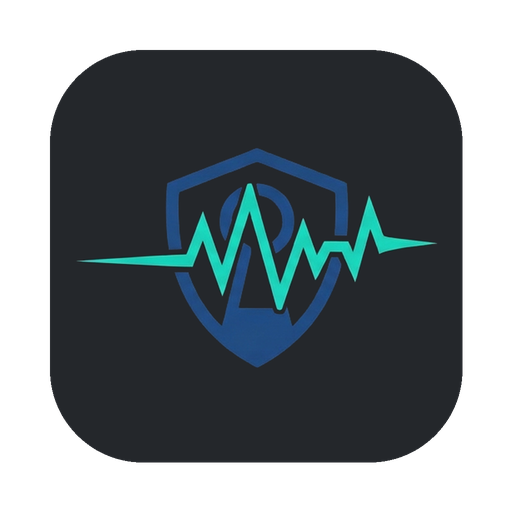

<p align="center">
  <a href="https://digitalis.io">
    
  </a>
</p>

<p align="center">
  
</p>

# Transikey

Desktop client for [OpenBao](https://openbao.org) and HashiCorp Vault: sign in, request short-lived database and SSH credentials, and share secrets once, without the CLI.

One Flutter codebase for macOS 13+, Windows 11+ and Linux (Ubuntu 22.04+). Built and tested on macOS so far; Windows and Linux are scaffolded but untested. Works with Vault OSS, Vault Enterprise (namespaces) and OpenBao, which share the same HTTP API.

## Quick start

You need [Flutter](https://docs.flutter.dev/get-started/install) 3.32 or newer and Docker.

```bash
git clone git@github.com:digitalis-io/transikey.git && cd transikey
make gen        # fetch packages, generate Freezed / JSON code
make dev-up     # OpenBao (dev mode) + PostgreSQL, fully configured
make run        # start the app
```

Sign in with address `http://127.0.0.1:8200` and one of these dev-only credentials (they exist only in the local, in-memory dev stack):

| Method | Credentials |
|--------|-------------|
| Token | `root` |
| Userpass | user `demo`, password `transikey-dev` |
| AppRole | output of `make dev-approle` |

Run `make help` for every task.

## Usage examples

### 1. Get temporary database credentials

1. Open **Database Credentials** (`Cmd/Ctrl+2`).
2. Pick the `short-lived` role, then **Request credentials**.
3. Reveal or copy the username and password. The clipboard clears after 30 seconds.
4. Watch the lease count down: green (active), yellow (expiring soon), red (expired). **Renew** or **Revoke** from the same card or from **Lease Management**.

Check the credentials against the dev database:

```bash
PGPASSWORD='<password>' psql -h 127.0.0.1 -U '<username>' -d app -c 'select current_user'
```

### 2. Hand a secret to a colleague, once

1. Open **Secret Sharing** (`Cmd/Ctrl+4`), tab **Wrap**.
2. Paste text or a JSON object, choose a time to live, **Wrap secret**.
3. Press **Copy share link** and send the link over any channel. It works one time, then it is void:

   ```text
   transikey://unwrap?addr=https%3A%2F%2Fvault.example.com%3A8200&token=hvs.CAES...
   ```

4. The colleague clicks the link. Transikey opens on the **Unwrap** tab with server and token filled in; nothing is sent until they press **Unwrap**. A link to a server other than their configured one asks for confirmation first. No session is needed to unwrap.
5. If someone else got there first, unwrapping fails, so interception is detectable.

No Transikey on the other side? **Copy CLI command** gives the recipient a one-liner instead.

The same exchange with the CLI:

```bash
bao write -wrap-ttl=30m sys/wrapping/wrap secret='s3cr3t'          # sender
BAO_ADDR='https://vault.example.com:8200' bao unwrap '<token>'   # recipient
```

### 3. Sign an SSH key

1. Open **SSH Access** (`Cmd/Ctrl+3`), choose the `sign` role, tab **Sign public key**.
2. **Upload public key** (for example `~/.ssh/id_ed25519.pub`), then **Sign key**.
3. **Download certificate** and save it as `~/.ssh/id_ed25519-cert.pub`. `ssh` picks it up automatically.

The **One-time password** tab issues an OTP for a target IP with the `otp` role.

## Configuration reference

All settings live in **Settings** (`Cmd/Ctrl+,`) and are stored in the OS keystore (Keychain, DPAPI or libsecret).

| Setting | Type | Default | Example |
|---------|------|---------|---------|
| Vault / OpenBao URL (`VAULT_ADDR`) | URL | empty | `https://vault.example.com:8200` |
| Namespace (`VAULT_NAMESPACE`) | string | empty | `team-a/prod` |
| Skip TLS verification | bool | off | on, for a test server with a self-signed certificate |
| Custom CA certificate | PEM file, added to the system trust store via **Import CA certificate** | none | `corp-root-ca.pem` |
| Lock after inactivity | seconds, `0` = never | `300` | `120` |
| Clear clipboard after | seconds, `0` = never | `30` | `10` |
| Biometric unlock | bool | off | on (Touch ID, Windows Hello) |
| Blur window when it loses focus | bool | on | off |
| Theme | `system` / `light` / `dark` | `system` | `dark` |
| Database mount | path | `database` | `postgres-prod` |
| SSH mount | path | `ssh` | `ssh-client-signer` |
| Userpass mount | path | `userpass` | `userpass-ops` |
| AppRole mount | path | `approle` | `approle-ci` |

Dev stack environment variables. Set them in the shell before `make dev-up`:

| Variable | Default | Example |
|----------|---------|---------|
| `DEV_BAO_PORT` | `8200` | `DEV_BAO_PORT=8210` |
| `DEV_BAO_ROOT_TOKEN` | `root` | `DEV_BAO_ROOT_TOKEN=dev-root` |
| `DEV_BAO_IMAGE` | `openbao/openbao:latest` | `DEV_BAO_IMAGE=openbao/openbao:2.0.0` (must ship the `bao` CLI) |
| `DEV_POSTGRES_PORT` | `5432` | `DEV_POSTGRES_PORT=5433` |
| `DEV_POSTGRES_PASSWORD` | `transikey-dev` | `DEV_POSTGRES_PASSWORD=local-only` |
| `DEV_USER` / `DEV_USER_PASSWORD` | `demo` / `transikey-dev` | `DEV_USER=alice` |

The dev stack is for local testing only: dev mode keeps data in memory, uses a fixed root token and binds to `127.0.0.1`.

## Keyboard shortcuts

| Shortcut (`Cmd` on macOS, `Ctrl` elsewhere) | Action |
|----------|--------|
| `+1` … `+6` | Jump to a sidebar section |
| `+B` | Collapse or expand the sidebar |
| `+L` | Lock the session |
| `+,` | Settings |

## Security model

- Secrets are masked until you press **Reveal**, and leave provider state when the session locks or ends.
- The token lives in memory and in the OS keystore only. Lock drops the in-memory copy; unlock needs biometrics, otherwise you sign in again.
- Logs carry method, path, status and latency. Headers and bodies are never logged, and every message passes a redaction filter (tokens, PEM blocks, SSH certificates).
- Sign out revokes tokens minted by a userpass or AppRole login. A token you pasted in is left valid: it is yours.
- The macOS build runs without the App Sandbox so that it can use the login keychain in unsigned builds. Re-enable the sandbox and the data-protection keychain when you ship a signed build.

## Development

```text
lib/
├── app/        bootstrap, providers, routing, navigation shell
├── core/       api (VaultApiClient, Dio), errors, models, security, theme, utils, widgets
└── features/   auth, database, ssh, sharing, leases, settings
                each with domain/ (contracts), data/ (repositories), presentation/ (Riverpod + UI)
```

| Task | Command |
|------|---------|
| Analyzer + offline tests | `make check` |
| Live API tests (the dev stack must be running) | `make dev-up && make test-integration` |
| Regenerate code after a model or `.feature` change | `make gen` |
| Release build for this machine | `make build` |

Tests follow BDD: Gherkin files in `test/bdd/*.feature`, step definitions in `test/bdd/step/` ([bdd_widget_test](https://pub.dev/packages/bdd_widget_test)).

### Releases

Push a version tag and GitHub Actions builds and publishes packages for all three platforms:

```bash
git tag -s v0.1.0 -m "v0.1.0" && git push origin v0.1.0
```

| Platform | Package |
|----------|---------|
| macOS | `transikey-v0.1.0-macos-universal.zip` (the `.app`) |
| Windows | `transikey-v0.1.0-windows-x64.zip` |
| Linux | `transikey-v0.1.0-linux-x64.tar.gz` |

`SHA256SUMS.txt` ships with every release. Packages are unsigned for now: macOS Gatekeeper and Windows SmartScreen will warn on first start. A tag with a suffix (`v0.2.0-rc1`) is published as a pre-release.

Regenerate the app icons after a logo change with `python3 tool/make_icons.py` (needs `pillow` and `numpy`).

### Not implemented yet

- System tray menu, screenshot prevention and multi-window: interfaces exist, platform code is a stub.
- `ssh/get-attempt-token`: the client calls it as specified, but current OpenBao and Vault releases answer `404 unsupported path`.
- `transikey://` links are registered on macOS only. Windows needs a registry entry and Linux a `.desktop` file with `x-scheme-handler/transikey`; both belong to a future installer.
- The Linux window icon is not set yet (macOS and Windows use the Transikey icon).
- Windows and Linux builds are scaffolded but have only been built on macOS so far.

## Contact

Maintained by [Digitalis.io](https://digitalis.io). Support: [digitalis.io/contact](https://digitalis.io/contact).

Licensed under the [Apache License 2.0](LICENSE).
