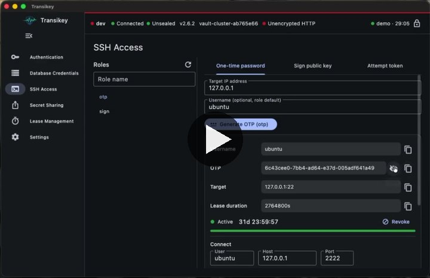

<p align="center">
  <a href="https://digitalis.io">
    
  </a>
</p>

<p align="center">
  
</p>

# Transikey

Desktop client for [OpenBao](https://openbao.org) and HashiCorp Vault: sign in, request short-lived database and SSH credentials, and share secrets once, without the CLI.

One Flutter codebase for macOS 13+, Windows 11+ and Linux (Ubuntu 22.04+). Built and tested on macOS so far; Windows and Linux are scaffolded but untested. Works with Vault OSS, Vault Enterprise (namespaces) and OpenBao, which share the same HTTP API.

<p align="center">
  <a href="https://youtu.be/l6h9bdtxv9M">
    
  </a>
  <br>
  <a href="https://youtube.com/shorts/l6h9bdtxv9M">▶ Watch the short demo on YouTube</a>
</p>

## Install

### macOS — Homebrew (recommended)

```bash
brew tap digitalis-io/tap
brew install --cask transikey
```

Upgrade and remove with the usual commands:

```bash
brew upgrade --cask transikey
brew uninstall --cask --zap transikey
```

The cask follows every release, release candidates included.

### macOS — manual

Download `transikey-<version>-macos-universal.zip` from the
[releases page](https://github.com/digitalis-io/transikey/releases), unzip it and move
`transikey.app` to `/Applications`. Check it against `SHA256SUMS.txt` first:

```bash
shasum -a 256 -c SHA256SUMS.txt --ignore-missing
```

### First launch on macOS

The app is not signed or notarised yet, so Gatekeeper blocks the first launch of a
downloaded copy — with Homebrew as well. Clear the quarantine flag once:

```bash
xattr -dr com.apple.quarantine /Applications/transikey.app
open -a transikey
```

Without the terminal: open `/Applications`, right-click `transikey.app`, choose **Open**, then
**Open** again in the dialog. On Sequoia, use **System Settings → Privacy & Security → Open Anyway**
after the first blocked attempt.

`transikey://unwrap?...` share links work as soon as the app sits in `/Applications`; macOS
registers the scheme from the bundle.

### Uninstall and the keychain

`--zap` removes the app and its preference and cache files. Sessions, tokens and server profiles
live in the **login keychain**, which Homebrew never touches. Remove them in Keychain Access by
searching for `transikey` and deleting the matching items.

### Windows and Linux

No package manager integration yet. Download from the
[releases page](https://github.com/digitalis-io/transikey/releases) and check the file against
`SHA256SUMS.txt`:

- **Windows**: unzip `transikey-<version>-windows-x64.zip` into a folder you keep, for example
  `%LOCALAPPDATA%\Programs\Transikey`, and run `transikey.exe`. The build is unsigned, so
  SmartScreen warns on first start: choose **More info → Run anyway**.
- **Linux**: `tar -xzf transikey-<version>-linux-x64.tar.gz` and run `transikey/transikey`.

`transikey://` links are registered on macOS only; see [Not implemented yet](#not-implemented-yet).

## Quick start (from source)

You need [Flutter](https://docs.flutter.dev/get-started/install) 3.32 or newer and Docker.

```bash
git clone git@github.com:digitalis-io/transikey.git && cd transikey
make gen        # fetch packages, generate Freezed / JSON code
make dev-up     # OpenBao (dev mode), PostgreSQL, OpenLDAP, SSH target; fully configured
make run        # start the app
```

Sign in with address `http://127.0.0.1:8200` and one of these dev-only credentials (they exist only in the local, in-memory dev stack):

| Method | Credentials |
|--------|-------------|
| Token | `root` |
| Userpass | user `demo`, password `transikey-dev` |
| LDAP | user `ldapdemo`, password `transikey-dev` |
| AppRole | output of `make dev-approle` |

OIDC needs a real identity provider, so the dev stack does not cover it. The OIDC role on your server must list `http://localhost:8250/oidc/callback` in `allowed_redirect_uris`, the same requirement as `vault login -method=oidc`. Transikey opens your browser, waits for the provider to redirect back to that loopback address, and signs you in.

Run `make help` for every task.

## Terms

| Term | Meaning |
|------|---------|
| Dynamic credentials | A database user created on request that the server deletes when its lease ends |
| Lease | The lifetime of an issued credential; it can be renewed or revoked early |
| OTP | One-time SSH password, valid for a single login to one target IP |
| Signed key | Your SSH public key turned into a short-lived certificate by the server's CA |
| Response wrapping | The server stores a secret and hands back a single-use token that reveals it once |
| Cubbyhole | A private store tied to one token; it disappears with that token |
| AppRole | Machine login with a role ID and a secret ID |
| Namespace | An isolated tenant inside Vault Enterprise or OpenBao |

## Usage examples

### 1. Get temporary database credentials

1. Open **Database Credentials** (`Cmd/Ctrl+2`).
2. Pick the `short-lived` role, then **Request credentials**. Roles of every database mount the server shows you are listed, grouped by mount (`database`, `cass001`, `cass002`…).
3. Reveal or copy the username and password. The clipboard clears after 30 seconds.
4. Watch the lease count down: green (active), yellow (expiring soon), red (expired). **Renew** or **Revoke** from the same card or from **Lease Management**.

5. Use the **Connect** section of the card, then copy the ready-made command or the connection URI. When your policy allows it (see below), the engine, host, port and database are read from the server. Otherwise choose PostgreSQL, MySQL or Cassandra and type them once: they are remembered per mount. A host you type always wins, because the server often knows the database under a name only it can resolve:

   ```bash
   PGPASSWORD='<password>' psql -h '127.0.0.1' -p 5432 -U '<username>' -d 'app'
   ```

   The password travels in an environment variable, not as an argument, so it does not show up in `ps`. `cqlsh` has no such variable: its command leaves the password out and `cqlsh` asks for it. Copy the password from the card when it prompts. Picking another role, on any mount, clears the card, so credentials of one role never sit next to another.

   Optional policy that lets the app detect the engine and address behind a role (the server never returns the connection password on these paths):

   ```hcl
   path "database/roles/*"  { capabilities = ["read"] }
   path "database/config/*" { capabilities = ["read"] }
   ```

### 2. Hand a secret to a colleague, once

1. Open **Secret Sharing** (`Cmd/Ctrl+4`), tab **Wrap**.
2. Paste text or a JSON object, choose a time to live, **Wrap secret**.
3. Press **Copy share link** and send the link over any channel. It works one time, then it is void:

   ```text
   transikey://unwrap?addr=https%3A%2F%2Fvault.example.com%3A8200&token=hvs.CAES...
   ```

4. The colleague clicks the link. Transikey opens on the **Unwrap** tab with server and token filled in; nothing is sent until they press **Unwrap**. A link to a server other than their configured one asks for confirmation first. No session is needed to unwrap.
5. If someone else got there first, unwrapping fails, so interception is detectable.

No Transikey on the other side? **Copy CLI command** gives the recipient a one-liner instead.

The same exchange with the CLI:

```bash
bao write -wrap-ttl=30m sys/wrapping/wrap secret='s3cr3t'          # sender
BAO_ADDR='https://vault.example.com:8200' bao unwrap '<token>'   # recipient
```

### 3. Log in over SSH with a signed key or a one-time password

The dev stack includes an SSH server (`ssh -p 2222 ubuntu@127.0.0.1`, container IP `172.30.0.10`) that trusts the OpenBao SSH CA and verifies OTPs through `vault-ssh-helper`.

Signed key:

1. Open **SSH Access** (`Cmd/Ctrl+3`), choose the `sign` role, tab **Sign public key**.
2. **Upload public key** (for example `~/.ssh/id_ed25519.pub`), then **Sign key**.
3. **Download certificate** and save it next to the key as `~/.ssh/id_ed25519-cert.pub`.
4. Copy the command from the **Connect** section (user, host, port and private key path are remembered; uploading `id_ed25519.pub` fills in the key path):

   ```bash
   ssh -p 2222 -i '~/.ssh/id_ed25519' -o CertificateFile='/Users/me/.ssh/id_ed25519-cert.pub' 'ubuntu@127.0.0.1'
   ```

   The dev `sign` role issues 30 minute certificates with a terminal (`permit-pty`).

One-time password:

1. Choose the `otp` role, tab **One-time password**, target IP `172.30.0.10` (the OTP is bound to the IP of the server it is meant for), then **Generate OTP**.
2. Copy a command from the **Connect** section and paste the OTP at the password prompt. It works exactly once:

   ```bash
   ssh -p 2222 -o PreferredAuthentications=keyboard-interactive -o PubkeyAuthentication=no 'ubuntu@127.0.0.1'
   ```

   With `sshpass` installed, the second command logs in without a prompt:

   ```bash
   SSHPASS='<otp>' sshpass -e ssh -p 2222 -o PreferredAuthentications=keyboard-interactive -o PubkeyAuthentication=no 'ubuntu@127.0.0.1'
   ```

## Configuration reference

All settings live in **Settings** (`Cmd/Ctrl+,`) and are stored in the OS keystore (Keychain, DPAPI or libsecret).

| Setting | Type | Default | Example |
|---------|------|---------|---------|
| Vault / OpenBao URL (`VAULT_ADDR`) | URL | empty | `https://vault.example.com:8200` |
| Namespace (`VAULT_NAMESPACE`) | string | empty | `team-a/prod` |
| Skip TLS verification | bool | off | on, for a test server with a self-signed certificate |
| Custom CA certificate | PEM file, added to the system trust store via **Import CA certificate** | none | `corp-root-ca.pem` |
| Lock after inactivity | seconds, `0` = never | `300` | `120` |
| Clear clipboard after | seconds, `0` = never | `30` | `10` |
| Biometric unlock | bool | off | on (Touch ID, Windows Hello) |
| Blur window when it loses focus | bool | on | off |
| Theme | `system` / `light` / `dark` | `system` | `dark` |
| Database mount | comma separated paths, used only when the server does not list its mounts | `database` | `cass001, cass002` |
| SSH mount | path | `ssh` | `ssh-client-signer` |
| Userpass mount | path | `userpass` | `userpass-ops` |
| AppRole mount | path | `approle` | `approle-ci` |
| LDAP mount | path | `ldap` | `ldap-corp` |
| OIDC mount | path | `oidc` | `okta` |
| Database client (Connect section) | `psql` / `mysql` / `cqlsh` | `psql` | `cqlsh` |
| Database host | string | `127.0.0.1` | `pg.internal.example.com` |
| Database port | integer | `5432` | `3306` |
| Database name (keyspace for Cassandra) | string | `app` | `orders` |
| SSH user (Connect section) | string | `ubuntu` | `ops` |
| SSH host | string | `127.0.0.1` | `bastion.example.com` |
| SSH port | integer | `2222` | `22` |
| SSH private key path | path | `~/.ssh/id_ed25519` | `~/.ssh/work_ed25519` |

The Database and SSH rows are edited in the **Connect** section of their screens, not under Settings; the defaults match the dev stack. Database values are kept per mount (per connection when the server reveals it); the defaults apply to a mount you have not edited yet.

Dev stack environment variables. Set them in the shell before `make dev-up`:

| Variable | Default | Example |
|----------|---------|---------|
| `DEV_BAO_PORT` | `8200` | `DEV_BAO_PORT=8210` |
| `DEV_BAO_ROOT_TOKEN` | `root` | `DEV_BAO_ROOT_TOKEN=dev-root` |
| `DEV_BAO_IMAGE` | `openbao/openbao:latest` | `DEV_BAO_IMAGE=openbao/openbao:2.0.0` (must ship the `bao` CLI) |
| `DEV_POSTGRES_PORT` | `5432` | `DEV_POSTGRES_PORT=5433` |
| `DEV_POSTGRES_PASSWORD` | `transikey-dev` | `DEV_POSTGRES_PASSWORD=local-only` |
| `DEV_USER` / `DEV_USER_PASSWORD` | `demo` / `transikey-dev` | `DEV_USER=alice` |
| `DEV_LDAP_USER` / `DEV_LDAP_USER_PASSWORD` | `ldapdemo` / `transikey-dev` | `DEV_LDAP_USER=bob` |
| `DEV_LDAP_ADMIN_PASSWORD` | `transikey-dev` | `DEV_LDAP_ADMIN_PASSWORD=local-only` |
| `DEV_SSHD_PORT` / `DEV_SSHD_IP` | `2222` / `172.30.0.10` | `DEV_SSHD_PORT=2200` |
| `DEV_SUBNET` | `172.30.0.0/24` | `DEV_SUBNET=10.99.0.0/24` (keep `DEV_SSHD_IP` inside it) |

The dev stack is for local testing only: dev mode keeps data in memory, uses a fixed root token and binds to `127.0.0.1`.

### Server profiles

Work with several servers? Save each one as a profile and pick it from the **Server** dropdown on the sign-in form.

| A profile remembers | A profile never stores |
|---------------------|------------------------|
| Name and colour tag, address, namespace, TLS verification, custom CA | Tokens |
| The six mount paths | Passwords, secret IDs |
| Database and SSH **Connect** targets | Issued credentials or leases |
| Last sign-in method and username | |

1. Sign in to a server, then **Save server profile** (session card or **Settings → Server profiles**). Name it, for example `prod`, and give it a colour tag such as red.
2. Next time pick `prod` from the dropdown: address, namespace, method and username are filled in.
3. Switching while signed in asks first, signs you out of the current server and clears the screen, so nothing issued by one server shows while another is active.
4. The status bar shows the active profile and a coloured edge, so prod never looks like dev.

Edits made while a profile is active (mounts, Connect targets, TLS) are saved to that profile. Typing a different address on the sign-in form detaches from the profile instead of overwriting it. Theme, lock timeout, clipboard timeout and biometric unlock are global.

### Import from the CLI environment

Already use the `bao` or `vault` CLI? When Transikey finds its settings, the sign-in form shows **Import from CLI**. One click fills in the form; nothing is sent or stored until you press **Sign in**.

| Source | Becomes |
|--------|---------|
| `BAO_ADDR`, else `VAULT_ADDR` | Address |
| `BAO_NAMESPACE`, else `VAULT_NAMESPACE` | Namespace |
| `BAO_CACERT`, else `VAULT_CACERT` | Custom CA certificate (file is read) |
| `BAO_SKIP_VERIFY`, else `VAULT_SKIP_VERIFY` | Skip TLS verification |
| `BAO_TOKEN`, else `VAULT_TOKEN`, else `~/.vault-token` | Token field (masked), method set to Token |

```bash
export BAO_ADDR=https://bao.example.com:8200
bao login -method=oidc      # writes ~/.vault-token
make run                    # or start the app from this shell
```

An app started from Finder, the Start menu or a desktop launcher does not see variables exported in your shell profile; start it from a terminal for those. The token file is found either way. Save the result as a server profile and you only do this once.

## Keyboard shortcuts

| Shortcut (`Cmd` on macOS, `Ctrl` elsewhere) | Action |
|----------|--------|
| `+1` … `+6` | Authentication, Database Credentials, SSH Access, Secret Sharing, Lease Management, Settings |
| `+B` | Collapse or expand the sidebar |
| `+L` | Lock the session |
| `+,` | Settings |

## Security model

- Secrets are masked until you press **Reveal**, and leave provider state when the session locks or ends.
- The token lives in memory and in the OS keystore only. Lock drops the in-memory copy; unlock needs biometrics, otherwise you sign in again.
- Logs carry method, path, status and latency. Headers and bodies are never logged, and every message passes a redaction filter (tokens, PEM blocks, SSH certificates).
- Sign out revokes tokens minted by a userpass, LDAP, OIDC or AppRole login. A token you pasted in is left valid: it is yours.
- The macOS build runs without the App Sandbox so that it can use the login keychain in unsigned builds. Re-enable the sandbox and the data-protection keychain when you ship a signed build.

## Development

```text
lib/
├── app/        bootstrap, providers, routing, navigation shell
├── core/       api (VaultApiClient, Dio), errors, models, security, theme, utils, widgets
└── features/   auth, database, ssh, sharing, leases, settings
                each with domain/ (contracts), data/ (repositories), presentation/ (Riverpod + UI)
```

| Task | Command |
|------|---------|
| Analyzer + offline tests | `make check` |
| Live API tests (the dev stack must be running) | `make dev-up && make test-integration` |
| Regenerate code after a model or `.feature` change | `make gen` |
| Release build for this machine | `make build` |

Tests follow BDD: Gherkin files in `test/bdd/*.feature`, step definitions in `test/bdd/step/` ([bdd_widget_test](https://pub.dev/packages/bdd_widget_test)).

### Releases

Push a version tag and GitHub Actions builds and publishes packages for all three platforms:

```bash
git tag -s v0.1.0 -m "v0.1.0" && git push origin v0.1.0
```

| Platform | Package |
|----------|---------|
| macOS | `transikey-v0.1.0-macos-universal.zip` (the `.app`) |
| Windows | `transikey-v0.1.0-windows-x64.zip` |
| Linux | `transikey-v0.1.0-linux-x64.tar.gz` |

`SHA256SUMS.txt` ships with every release. The publish job then renders `packaging/homebrew/transikey.rb` with the new version and the checksum of the macOS zip and pushes it to `digitalis-io/homebrew-tap` as `Casks/transikey.rb`, so `brew upgrade --cask transikey` picks the release up. That step needs the `BREW_SSH_KEY` secret: the base64 of a private SSH key whose public half is a deploy key with write access on the tap. Without the secret the job warns and the release still succeeds. Packages are unsigned for now: macOS Gatekeeper and Windows SmartScreen will warn on first start. A tag with a suffix (`v0.2.0-rc1`) is published as a pre-release.

Regenerate the app icons after a logo change with `python3 tool/make_icons.py` (needs `pillow` and `numpy`).

### Not implemented yet

- System tray menu, screenshot prevention and multi-window: interfaces exist, platform code is a stub.
- `ssh/get-attempt-token`: the client calls it as specified, but current OpenBao and Vault releases answer `404 unsupported path`.
- `transikey://` links are registered on macOS only. Windows needs a registry entry and Linux a `.desktop` file with `x-scheme-handler/transikey`; both belong to a future installer.
- The Linux window icon is not set yet (macOS and Windows use the Transikey icon).
- Windows and Linux builds are scaffolded but have only been built on macOS so far.

## Contact

Maintained by [Digitalis.io](https://digitalis.io). Support: [digitalis.io/contact](https://digitalis.io/contact).

Licensed under the [Apache License 2.0](LICENSE).
